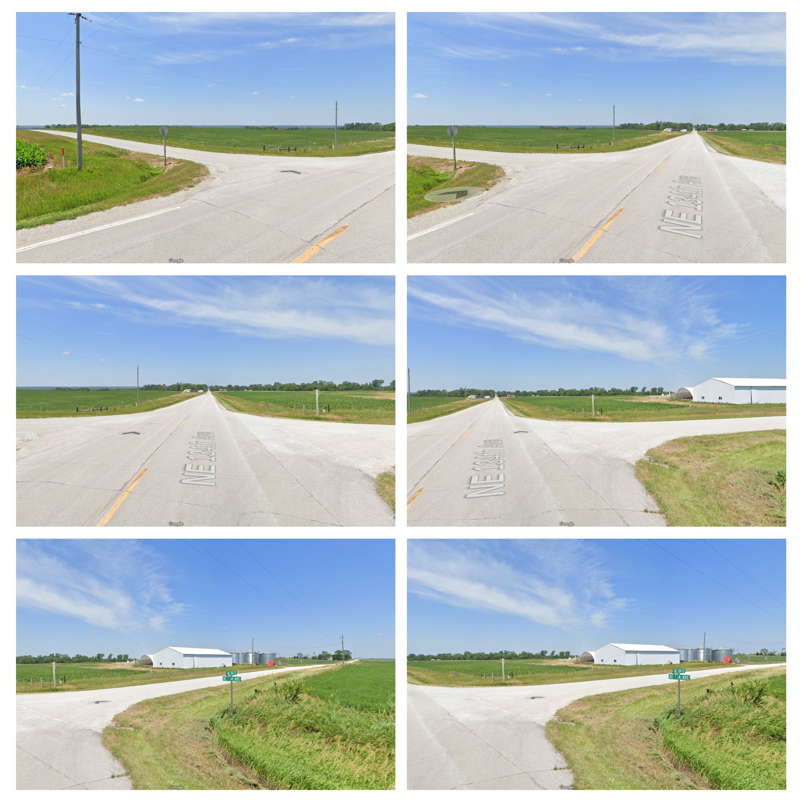
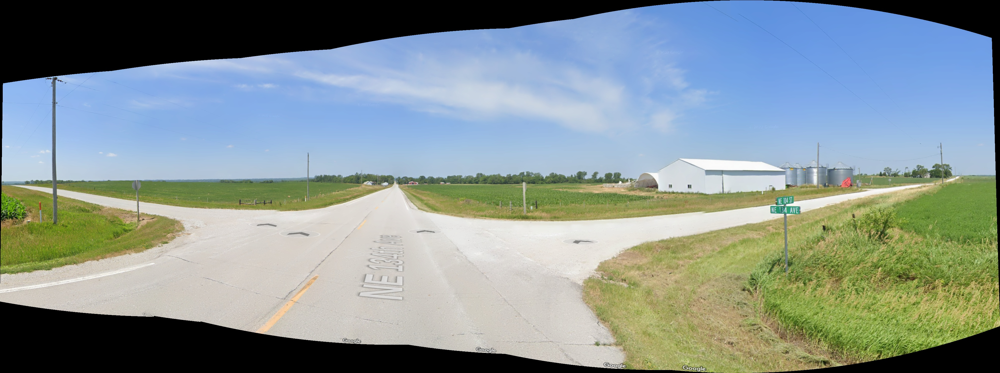
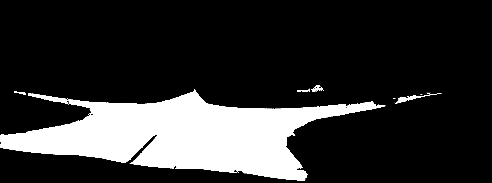
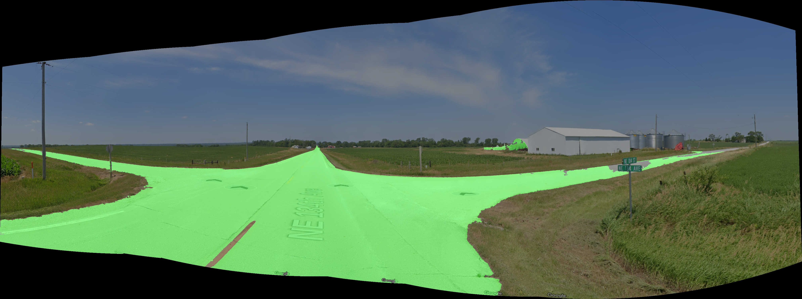
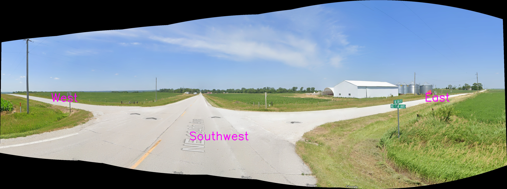

# Real-Time Road Segmentation and Travel Direction Estimation

This project processes images from a car's hood camera to create a stitched panorama, segment the road, highlight road sections, and estimate possible travel directions in real-time.

## Features
- Loads multiple images from the hood camera
- Stitches images into a wide panorama
- Segments road regions using color masking
- Cleans the segmented mask to remove noise
- Highlights road sections on the panorama
- Estimates and overlays possible travel directions

## Project Structure
```
|-- image_loader.py        # Loads images from disk
|-- stitcher.py            # Stitches images into a panorama
|-- masking.py             # Performs road segmentation and mask cleaning
|-- visualization.py       # Colors road sections and overlays directions
|-- utils.py               # Helper functions (resizing, etc.)
|-- main.py                # Entry point to run the full pipeline
```

## Installation
Ensure you have Python 3.x and install the required dependencies:
```sh
pip install opencv-python numpy
```

## Usage
Run the main script to execute the full pipeline:
```sh
python main.py
```

## Input
images from front-view cameras of a car.


## Output
### Stitched Image
Generated panorama from multiple images.


### Road Mask
Segmented mask highlighting road areas.


### Highlighted Roads
Overlayed mask on the panorama to visualize detected roads.


### Final Output
Image with estimated travel directions overlaid.


## Dependencies
- OpenCV
- NumPy

## License
This project is open-source and available under the MIT License.

